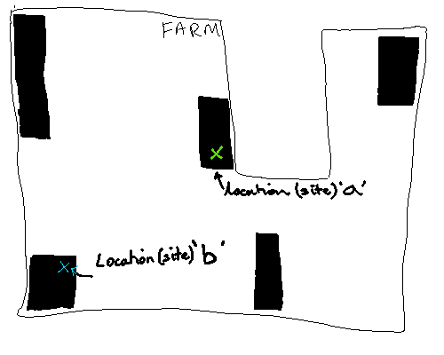

```{r setup, include=FALSE}
knitr::opts_chunk$set(echo = TRUE)
library(ggplot2); library(dplyr)
library(tidyr)
library(viridis)
library(distr)
distroptions(WarningArith = FALSE)
```

## Scale and Aggregation
Many ecologists acknowledge that scale is important. But what exactly does 'scale' mean?
In this project it appears that there are many relevant scales:

  + the spatial scale of predictions (e.g. biodiveristy of a site, a farm or a landscape)
  + the *temporal* scale of predictions (e.g. 5 minutes of detection effort, 20 minutes of detection effort, 1 hour of detection effort spread over three years)
  + the spatial scale of the regions that the predictors describe (e.g. the proportion of woody vegetation over a small region, a farm-scale region, or a landscape)

These different scales pertain to different extents of *aggregation* in either space or time.
The species detected on a farm is an aggregation of the species detected at each site in the farm.
The biodiversity of a farm is an aggregation of the biodiversity of woody vegetation patches within the farm.
The percent of woody vegetation at farm scale is an aggregation of the woody vegetation at each location within the farm.

## Aggregation Methods
### Spatial Aggregation for Detection of a Species
Fix a species of interest (e.g. Treecreepers).
Let us denote it by $S$.

Suppose every detection *attempt* (e.g. a 5 minute visit) is a single unit of detection effort.
Denote the exact location of detection attempt $i$ by $x_i$.
Denote the *event* (in probability theory terminology) of detecting species $S$ by detection attempt $i$ as $S_i$.

*Assume* that the act of *detecting* a species does not affect the species in any way:
 detection of $S$ at attempt $i$, does not impact the detection of $S$ at attempt $j$, $j \neq i$.
In other words,
the event $S_i$ is independent of any other detection event $S_j$, $j \neq i$.
Note that independence is not true, for example, when animals follow the field worker.

We could arrive at the same independence of detection events by assuming that detection depends purely on residency rates of species $S$ and on the behaviour of species $S$, and that detection changes neither of these properties.

Let $P(S_i) = p_i$. 
The probability of detection $S$ in any of $n$ detection attempts is
$$P(any(S_i, i = 1, 2, ..., n) = 1 - \prod_{i = 1}^n (1 - p_i).$$
If we know $p_i$ for any number and location of detection attempts, for example through modelling, then we can predict the probability of detecting $S$.

#### Example
Suppose the probablity of detecting $S$ is constant at each location. Which implies that detection probability depends only on time-constant environmental variables such as amount of vegetation nearby, distance to water and latitude.
Then $$P(S_i) = f(x_i),$$
where $f$ is a fixed function.

Suppose that detection attempts alternate between location $a$ and $b$, starting with location $a$.
So $P(S_i) = f(a), i = 1, 3, 5, ...$ and $P(S_i) = f(b), i = 2, 4, 6, ...$.



+ Probability of detecting $S$ from the first detection attempt is  $P(S_1) = f(a)$.
+ Probability of detecting $S$ from the just the second detection attempt is  $P(S_2) = f(b)$.
+ Probability of detecting $S$ from the first and second detection attempt is  $1 - (1 - f(a))(1 - f(b))$.
+ Probability of detecting $S$ from the first four detection attempts is  $1 - (1 - f(a))^2(1 - f(b))^2$.

We can split these attempts into units of effort at (1) $a$, (2) $b$, and (3) units of effort evenly split between $a$ and $b$ (only for even amounts of effort).
Below is an example of how probability of detection of $S$ increases.
For this example $f(a) = 0.4$, and $f(b) = 0.1$.

```{r Sdetectprob, echo = FALSE}
pdetect <- function(t, p){
  return(1 - ((1 - p)^t))
}
pa <- 0.3
pb <- 0.1

ptable <- data.frame(Attempt = 1:40)
ptable$location <- NA
ptable$location[as.logical(ptable$Attempt %% 2)] <- "a"
ptable$location[as.logical(1 -ptable$Attempt %% 2)] <- "b"
ptable$pdet[ptable$location == "a"] <- pa
ptable$pdet[ptable$location == "b"] <- pb
ptable$qdet <- 1 - ptable$pdet

loca_only <- ptable %>%
  filter(location == "a") %>%
  mutate(pdet_cum = 1 - cumprod(qdet),
         effort = row_number()) %>%
  select(pdet_cum, effort)

locb_only <- ptable %>%
  filter(location == "b") %>%
  mutate(pdet_cum = 1 - cumprod(qdet),
         effort = row_number()) %>%
  select(pdet_cum, effort)

locab <- ptable %>%
  mutate(pdet_cum = 1 - cumprod(qdet),
         effort = row_number()) %>%
  filter(location == "b") %>%
  select(pdet_cum, effort)

loca_only %>%
  inner_join(locb_only, by = "effort", suffix = c(".a", ".b") ) %>%
  left_join(locab, by = "effort", suffix  = c("", ".ab")) %>%
  pivot_longer(cols = starts_with("pdet_cum"), names_prefix = "pdet_cum") %>%
  ggplot() +
  geom_point(aes(x = effort, y = value, col = name, pch = name),
             na.rm = TRUE) +
  ggtitle("Detection Probability with Increasing Effort") +
  scale_color_discrete(name = "Effort",
                      labels = c("Split evenly",
                                 "Only at a",
                                 "Only at b")) +
  scale_shape_discrete(name = "Effort",
                      labels = c("Split evenly",
                                 "Only at a",
                                 "Only at b")) +
  xlab("Effort ~ Units of Time (say)") +
  ylab("Detection Probability")
```


### Aggregation of Species Detection *Probability* into Species Richness
As aggregation is very closely related to scale, we present here a possible method for aggregating species detection probabilities to detection richness.

The expected number of species detected __can__ be calculated from detection probabilities regardless of dependence (or independence) strutures.
This is because the probability of detecting a species is the expectated value of an indicator event. 
Let $D_k$ be the detection event of species $k$, where $D_k = 1$ represents detection of species $k$, and $D_k = 0$ represents no detection of species $k$.
Then $E(D_k) = P(D_k  = 1) = p_k$ is probability of detecting species $k$.
Thus the sum of probabilities
$$\sum_k^K p_k = \sum_k^K E(D_k) = E(\sum_k^K D_k) =r$$
is the expected number of species detected, $r$.


If there is dependence between species, and this dependence follows specific structures then distributional information for the number of species detected $\sum_k^K D_k$ may be possible.
It also may be possible to develop credible intervals for $r$.
[Warton, Hui et al.](http://www.sciencedirect.com/science/article/pii/S0169534715002402) [Box 3] appear to simulate the number of species observed to get an empirical distribution of richness of tree species.
Their simulation used samples from the mcmc chain for covariate coefficients.
For each sample from the mcmc chain, 1000 samples of the latent variables were generated by simulating from a Normal distribution.
for each of these 1000 samples, the number of species observed was simulated once.
The median of these 1000 samples was taken, corresponding to a single, simulated species richness for each mcmc sample.
Quantiles and the mean were computed from this collection of simulated species richness.

If species are independent, and detection attempts are independent, then we can get a distribution of the number of species detected as below.
Let $D_{ki}$ be the event of detecting species $k$ during detection attempt $i$.
Then the probability distribution of the number of species detected, $N$, can be computed if $P(D_{ki}) = p_{ki}$ is known.

For a single attempt 
$$ P(N = n) = \sum_{d = 1}^D p_{11}^{I_d(1)} p_{21}^{I_d(2)} ... p_{T1}^{I_d(T)} 
\,\,\, (1 - p_{11})^{1 - I_d(1)} (1 - p_{21})^{1 - I_d(2)} ... (1 - p_{T1})^{1 - I_d(T)}$$
where $T$ is the total number of species in the environment,
$D$ is the number of different combinations of $n$ species,
$I_1$, $I_2$, ... $I_D$, is a set of indicator functions for each of these combinations.
$I_d(k) = 1$ if species $k$ is in the $d$th combination.


Suppose there is $K = 20$ species in total and that the probability of detection for a unit of effort for each species is
```{r multiplespecies_pi, echo = FALSE}
p_i <- runif(20, min = 0, max = 0.5)
print(p_i)
```
(which are all less than 0.5).

Then the probability distribution of richness is in the below figure.

```{r multiplespecies, echo = FALSE}
names(p_i) <- 1:length(p_i)
# richness_dist <- function(p_i){
#   richness_p <- vapply(0:length(p_i), function(x) probrichness(p_i, x), FUN.VALUE = 0.1)
#   R <- DiscreteDistribution(supp = 0:length(p_i), prob = richness_p)
#   return(R)
# }
richness_dist_distr <- function(p_i){
  D_l <- lapply(p_i, function(x) DiscreteDistribution(0:1, prob = c(1 - x, x)))
  R <- Reduce("+", D_l)
  return(R)
}
# R1 <- richness_dist(p_i)
# R2 <- richness_dist_distr(p_i)
# all.equal(R1@d(R1@support), R2@d(R2@support))

R <- richness_dist_distr(p_i)

data.frame(R = R@support,  p = R@d(R@support)) %>%
  ggplot() +
  geom_point(aes(x = R, y = p)) +
  ggtitle("Distribution of Number of Species Detected",
          subtitle = "for a Hypothetical Earth with 20 Species and a Single Unit of Effort") +
  ylab("Probability") +
  xlab("Detected Richness = Number of Species Detected")
```

Consider now performing more effort at this site and that each detection attempt has the same probability of detection $p_k = p_{ki}, i = 1, 2, 3, ....$.
Then the *expected* detected richness is shown below.
It increases similarly to an accumulation curve, although it asymptotes to 10.

```{r expected richness, echo = FALSE}
expectedrichness <- function(p_i){
  return(sum(p_i))
}


# calculate for increase time effort
t <- 1 : 20
p_i_t <- lapply(p_i, function(p) pdetect(t, p))
p_i_t <- data.frame(p_i_t)
row.names(p_i_t) <- t
rich_dist <- apply(p_i_t, 1, richness_dist_distr) #takes a REAALLY long time for many species

q025 <- vapply(rich_dist, function(x) x@q(0.025), FUN.VALUE = 0.1)
q975 <- vapply(rich_dist, function(x) x@q(0.975), FUN.VALUE = 0.1)
# mean <- lapply(rich_dist, function(x) sum(x@support * x@d(rich_dist[[1]]@support)))
mean <- apply(p_i_t, 1, expectedrichness)

rich_dist_summ <- data.frame(cbind(q025, mean, q975))
rich_dist_summ$Effort <- as.numeric(row.names(rich_dist_summ))
ggplot(data = rich_dist_summ) +
  geom_point(aes(x = Effort, y = mean)) +
  geom_errorbar(aes(x = Effort, ymin = q025, ymax = q975),
                width = 0.3) +
  ylab("Numbers of Species Detected") +
  ggtitle("Richness Distribution",
          subtitle = "Mean, 2.5% quantile, and 97.5% quantile")
```


One of the benefits of accumulation curves created directly from observations is that they may give an indication of the number of *undetected* species. The above computations do not hold this benefit.

## Two Interesting Model Forms
### A Model for Site-Scale Predictions from (mostly) Farm-Scale Predictors

Two-types of predictors:
  + farm-scale predictors supplied externally. Constant for all locations within a farm.
  + at-location/patch predictors supplied by user (e.g. farmer), such as vegetation type and whether it is fenced.
  
Such a model could be fitted using our existing data.
It could be tested against external predictors that vary-spatially within a farm.
It could allow for answering hypothetical questions like: "if I stopped stock from getting into this patch would biodiversity increase?"

### A Model for Farm-Scale Predictions from (mostly) Farm-Scale Predictors

Two-types of predictors:
  + farm-scale predictors supplied externally
  + farm-scale predictors supplied by user (e.g. farmer)

Allows for hypothicals about farm-scale management.
"If I grazed more everywhere then what will happen over all to farm?"
"If I fenced all my woody veg patches, what will happen?"
"If I decrease woody veg by 5%, what will happen?"

## Side Notes  
### When are differences in scale not aggregation?
This can occur for *emergent* phenomena. The following are possible examples, with further inspection a suitable aggregation method may be found.

+ Behaviour of small numbers of starlings within a murmeration may to be to 'aggregated' to the spectacular, behaviour as whole of the murmeration.
+ An 100m^2 subset of a region may contain part of an ecological system, and this scale the system could always appear unstable. However over a 10 000m^2 the system could appear stable.

